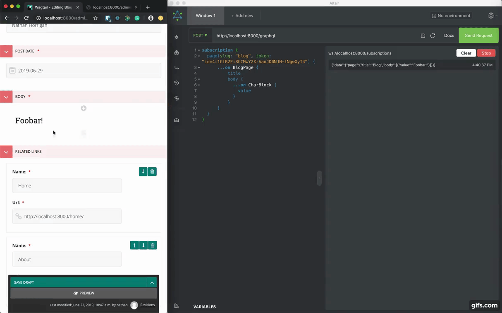

<p align="center">
  <a href="https://github.com/torchbox/wagtail-grapple">
    
  </a>
</p>

# Wagtail Grapple

[](https://github.com/torchbox/wagtail-grapple/actions)
[](https://pypi.org/project/wagtail-grapple/)
[](https://github.com/psf/black)
[](https://github.com/pre-commit/pre-commit)

A library to build GraphQL endpoints easily so you can grapple your Wagtail data from anywhere!

[Explore the docs »](https://wagtail-grapple.readthedocs.io/en/latest/) ·
[Report Bug](https://github.com/torchbox/wagtail-grapple/issues) ·
[Request Feature](https://github.com/torchbox/wagtail-grapple/issues)

## About The Project



There is a range of GraphQL packages for Python and specifically Django.
However, getting these packages to work out of the box with an existing infrastructure
without errors isn't as easy to come by.

The purpose of Grapple is to be able to build GraphQL endpoints on a model by model
basis as quickly as possible. The setup and configuration have been designed
to be as simple but also provide the best features;
No complex serializers need to be written - just add a `graphql_fields` list
to your model and away you go (although if you want to go deeper you can!).

### Features

-   Easily create GraphQL types by adding a small annotation in your models.
-   Supports traditional Wagtail models:
    -   Pages (including Streamfield & Orderables)
    -   Snippets
    -   Images
    -   Documents
    -   Media
    -   Settings
    -   Redirects
    -   Search (on all models)
-   Custom Image & Document model support
-   Pagination support
-   Middleware support
-   Advanced headless preview functionality built using GraphQL Subscriptions to enable Page previews on any device!

### Built With

This library is an abstraction upon and relies heavily on Graphene & Graphene Django.
We also use Django Channels and the Potrace image library.

-   [Graphene](https://github.com/graphql-python/graphene)
-   [Graphene Django](https://github.com/graphql-python/graphene)
-   [Potrace](https://github.com/skyrpex/potrace)
-   [Django Channels](https://github.com/django/channels) when installed with `wagtail_grapple[channels]`

## Getting Started

Getting Grapple installed is designed to be as simple as possible!

### Prerequisites

```
Django  >= 3.0, <4.0
Wagtail >= 2.15, <4.1
```

### Installation

```bash
pip install wagtail_grapple
```

Add the following to the `INSTALLED_APPS` list in your Wagtail settings file:

```python
INSTALLED_APPS = [
    # ...
    "grapple",
    "graphene_django",
    # ...
]
```

For GraphQL Subscriptions with Django Channels, run `pip install wagtail_grapple[channels]` and add
`channels` to installed apps:

```python
INSTALLED_APPS = [
    # ...
    "grapple",
    "graphene_django",
    "channels",
    # ...
]
```

Add the following to the bottom of the same settings file, where each key is the app you want to this library to scan and the value is the prefix you want to give to GraphQL types (you can usually leave this blank):

```python
# Grapple config:
GRAPHENE = {"SCHEMA": "grapple.schema.schema"}
GRAPPLE = {
    "APPS": ["home"],
}
```

Add the GraphQL URLs to your `urls.py`:

```python
from grapple import urls as grapple_urls

# ...
urlpatterns = [
    # ...
    path("api/", include(grapple_urls)),
    # ...
]
```

Done! Now you can proceed onto configuring your models to generate GraphQL types that adopt their structure :tada:
_Your GraphQL endpoint is available at [http://localhost:8000/api/graphql/](http://localhost:8000/api/graphql/)_

## Usage

Here is a GraphQL model configuration for the default page from the Wagtail docs:

```python
# ...
from grapple.models import GraphQLString, GraphQLStreamfield


class BlogPage(Page):
    author = models.CharField(max_length=255)
    date = models.DateField("Post date")
    body = StreamField(
        [
            ("heading", blocks.CharBlock(classname="full title")),
            ("paragraph", blocks.RichTextBlock()),
            ("image", ImageChooserBlock()),
        ]
    )

    content_panels = Page.content_panels + [
        FieldPanel("author"),
        FieldPanel("date"),
        StreamFieldPanel("body"),
    ]

    # Note these fields below:
    graphql_fields = [
        GraphQLString("heading"),
        GraphQLString("date"),
        GraphQLString("author"),
        GraphQLStreamfield("body"),
    ]
```

_For more examples, please refer to the [Documentation](https://wagtail-grapple.readthedocs.io/en/latest/)_

## Contributing

Contributions are what make the open source community such an amazing place to be learn, inspire, and create. Any contributions you make are **greatly appreciated**.

1. Fork the Project
2. Create your Feature Branch (`git checkout -b feature/amazing-feature`)
3. Commit your Changes (`git commit -m 'Add some amazing feature'`)
4. Push to the Branch (`git push origin feature/amazing-feature`)
5. Open a Pull Request

### Local development

-   In the python environment of your choice, navigate to `/example`
-   Run `pip install -r requirements.txt`
-   Delete the `db.sqlite3` file and run `./manage.py migrate`
-   Run server `./manage.py runserver`
-   Run tests `./manage.py test`

## Compatibility

Wagtail Grapple supports:

-   Django >= 3.0, < 4.0
-   Python 3.7, 3.8, 3.9, and 3.10
-   Wagtail >= 2.15, < 4.0

## License

Distributed under the MIT License. See `LICENSE` for more information.

<!-- ACKNOWLEDGEMENTS -->

## Inspired by

-   [@tr11](https://github.com/tr11)
-   [@tmkn](https://github.com/tmkn)

## Contributors ✨

Thanks goes to these wonderful people ([emoji key](https://allcontributors.org/docs/en/emoji-key)):

<!-- ALL-CONTRIBUTORS-LIST:START - Do not remove or modify this section -->
<!-- prettier-ignore-start -->
<!-- markdownlint-disable -->
<table>
  <tr>
    <td align="center"><a href="https://github.com/NathHorrigan"><br /><sub><b>Nathan Horrigan</b></sub></a><br /><a href="https://github.com/torchbox/wagtail-grapple/commits?author=NathHorrigan" title="Code">💻</a> <a href="https://github.com/torchbox/wagtail-grapple/issues?q=author%3ANathHorrigan" title="Bug reports">🐛</a> <a href="https://github.com/torchbox/wagtail-grapple/commits?author=NathHorrigan" title="Documentation">📖</a> <a href="#infra-NathHorrigan" title="Infrastructure (Hosting, Build-Tools, etc)">🚇</a> <a href="#maintenance-NathHorrigan" title="Maintenance">🚧</a></td>
    <td align="center"><a href="https://github.com/jafacakes2011"><br /><sub><b>Cameron Lamb</b></sub></a><br /><a href="https://github.com/torchbox/wagtail-grapple/commits?author=jafacakes2011" title="Code">💻</a> <a href="https://github.com/torchbox/wagtail-grapple/issues?q=author%3Ajafacakes2011" title="Bug reports">🐛</a> <a href="https://github.com/torchbox/wagtail-grapple/commits?author=jafacakes2011" title="Documentation">📖</a> <a href="#infra-jafacakes2011" title="Infrastructure (Hosting, Build-Tools, etc)">🚇</a> <a href="#maintenance-jafacakes2011" title="Maintenance">🚧</a></td>
    <td align="center"><a href="https://zerolab.org/"><br /><sub><b>Dan Braghis</b></sub></a><br /><a href="https://github.com/torchbox/wagtail-grapple/commits?author=zerolab" title="Code">💻</a> <a href="https://github.com/torchbox/wagtail-grapple/issues?q=author%3Azerolab" title="Bug reports">🐛</a> <a href="https://github.com/torchbox/wagtail-grapple/commits?author=zerolab" title="Documentation">📖</a> <a href="#infra-zerolab" title="Infrastructure (Hosting, Build-Tools, etc)">🚇</a> <a href="#maintenance-zerolab" title="Maintenance">🚧</a></td>
    <td align="center"><a href="https://github.com/ruisaraiva19"><br /><sub><b>Rui Saraiva</b></sub></a><br /><a href="https://github.com/torchbox/wagtail-grapple/commits?author=ruisaraiva19" title="Code">💻</a> <a href="https://github.com/torchbox/wagtail-grapple/issues?q=author%3Aruisaraiva19" title="Bug reports">🐛</a> <a href="https://github.com/torchbox/wagtail-grapple/commits?author=ruisaraiva19" title="Documentation">📖</a> <a href="#infra-ruisaraiva19" title="Infrastructure (Hosting, Build-Tools, etc)">🚇</a> <a href="#maintenance-ruisaraiva19" title="Maintenance">🚧</a></td>
    <td align="center"><a href="https://github.com/tbrlpld"><br /><sub><b>Tibor</b></sub></a><br /><a href="https://github.com/torchbox/wagtail-grapple/commits?author=tbrlpld" title="Code">💻</a> <a href="https://github.com/torchbox/wagtail-grapple/issues?q=author%3Atbrlpld" title="Bug reports">🐛</a> <a href="https://github.com/torchbox/wagtail-grapple/commits?author=tbrlpld" title="Documentation">📖</a></td>
    <td align="center"><a href="https://github.com/timmysmalls"><br /><sub><b>timmysmalls</b></sub></a><br /><a href="https://github.com/torchbox/wagtail-grapple/commits?author=timmysmalls" title="Code">💻</a> <a href="https://github.com/torchbox/wagtail-grapple/issues?q=author%3Atimmysmalls" title="Bug reports">🐛</a></td>
    <td align="center"><a href="https://wagtail.io/"><br /><sub><b>Tom Dyson</b></sub></a><br /><a href="https://github.com/torchbox/wagtail-grapple/commits?author=tomdyson" title="Code">💻</a> <a href="https://github.com/torchbox/wagtail-grapple/commits?author=tomdyson" title="Documentation">📖</a></td>
  </tr>
  <tr>
    <td align="center"><a href="https://fabien.cool/"><br /><sub><b>fabienheureux</b></sub></a><br /><a href="https://github.com/torchbox/wagtail-grapple/commits?author=fabienheureux" title="Code">💻</a> <a href="https://github.com/torchbox/wagtail-grapple/issues?q=author%3Afabienheureux" title="Bug reports">🐛</a> <a href="https://github.com/torchbox/wagtail-grapple/commits?author=fabienheureux" title="Documentation">📖</a></td>
  </tr>
</table>

<!-- markdownlint-restore -->
<!-- prettier-ignore-end -->

<!-- ALL-CONTRIBUTORS-LIST:END -->

This project follows the [all-contributors](https://github.com/all-contributors/all-contributors) specification. Contributions of any kind welcome!
